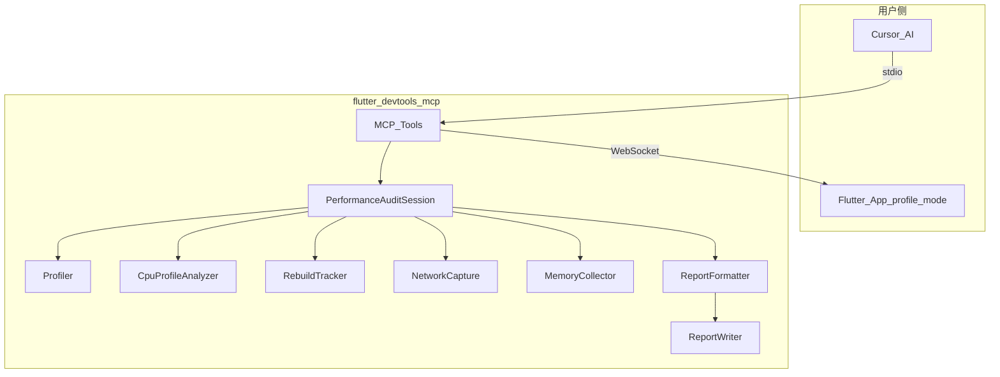

# Flutter App 全方位性能测试报告 — 需求开发文档

> 状态说明（2026-07）：本方案属于重型审计设计（Markdown+HTML / 自动化场景），当前仓库已优先落地轻量方案 `collect_performance_session`。  
> **实际开发与回归请优先参考：**  
> - [`performance-metrics-guide.md`](./performance-metrics-guide.md)（指标怎么读）  
> - [`performance-session-simple-design.md`](./performance-session-simple-design.md)（会话设计）  
> 本文件作为 P2 规划保留。

## 1. 背景与目标

### 1.1 背景

`flutter-devtools-mcp` 已通过 MCP 协议将 AI 助手（Cursor、Claude 等）连接到运行中的 Flutter App，提供 21 个独立调试工具（Widget 树、重建追踪、性能分析、内存、网络等）。

**现状问题**：

- 各能力分散，需多次 `start/stop` 手动串联
- 报告为 MCP 对话内纯文本，无法存档、对比、分享
- 重建追踪、网络抓包的状态写在 tool 闭包内，无法被统一编排复用

### 1.2 目标

新增**统一性能审计**能力，在一次会话中并行采集多维度数据，生成可存档的 **Markdown + HTML** 全方位性能报告。

### 1.3 已确认的产品决策

| 决策项 | 选择 |
|--------|------|
| 报告格式 | Markdown + HTML 双格式导出 |
| 采集模式 | 第一阶段：手动操作会话；第二阶段：自动化场景驱动 |
| 基础平台 | 基于现有 `flutter-devtools-mcp` 扩展，不另起项目 |

---

## 2. 用户故事

### 2.1 手动审计（P0）

> 作为 Flutter 开发者，我希望在 Cursor 中说「开始性能审计」，在 App 里操作 10–30 秒后说「停止并生成报告」，自动得到包含帧率、重建、内存、网络、**Top 耗时函数**的完整报告文件。

### 2.2 报告存档与分享（P0）

> 作为团队负责人，我希望报告以 `.md` / `.html` 落地到本地目录，便于 PR 附件、飞书分享、版本对比。

### 2.3 自动化审计（P1，骨架）

> 作为 QA，我希望预置场景（如首页滚动、列表加载）能通过 integration_test 自动驱动，无需人工操作。

---

## 3. 功能范围

### 3.1 本期做（In Scope）

| 模块 | 内容 |
|------|------|
| Collector 服务化 | 抽取 `RebuildTracker`、`NetworkCapture`、`MemoryCollector` |
| CPU 函数采样 | `CpuProfileAnalyzer`：VM `getCpuSamples` 解析 Top 耗时函数 |
| 报告模型 | 统一 `PerformanceReport` 数据结构 |
| 报告格式化 | Markdown + HTML 生成、健康评分、综合建议 |
| 审计编排 | `PerformanceAuditSession` 并行启停采集器 |
| MCP 工具 | `start_performance_audit`、`stop_performance_audit` |
| 文件导出 | 写入 `./performance-reports/` |
| 自动化 | 可运行 Dart 示例 + MCP `list_audit_scenarios` / `run_automated_audit` |
| 文档 | README 更新 |

### 3.2 本期不做（Out of Scope）

- Shader 编译 jank 检测
- 实时 jank 监控
- PDF 导出
- npm publish
- 图形化火焰图 / 调用树可视化（仅表格 Top N）
- 完整 Patrol / integration_test 端到端自动化

---

## 4. 系统架构



### 4.1 与现有架构关系

- **不破坏**现有 21 个 MCP 工具 API
- 新 Collector 服务供「旧 tool」和「新 audit」共用
- 底层仍走 Dart VM Service Protocol（与 DevTools 相同）

---

## 5. 报告内容设计（8 节）

| 章节 | 数据来源 | 核心指标 |
|------|----------|----------|
| 1. 执行摘要 | 综合计算 | 健康评分 0–100、严重问题数、Top 3 修复项 |
| 2. 环境信息 | `get_app_info` | VM 版本、平台、isolate、刷新率、profile 模式提示 |
| 3. 帧性能 | `Profiler` | FPS、jank%、P90/P99、Build/Layout/Paint、Timeline CPU 热点 |
| 4. **Top 耗时函数** | `CpuProfileAnalyzer` | 函数名、文件、Self 耗时、占比、严重等级（项目内 + 全局） |
| 5. Widget 重建 | `RebuildTracker` | Top N 重建 Widget、源码位置、严重等级 |
| 6. 内存 | `MemoryCollector` | 堆用量/利用率、Top 类、可疑分配 |
| 7. 网络 | `NetworkCapture` | 请求数、错误率、慢请求、大响应 |
| 8. 综合建议 | 跨维度合并 | P0/P1/P2 分级建议 |

### 5.1 Top 耗时函数（CPU 采样）

与 DevTools CPU Profiler 同源，通过 VM Service 采样实现**函数级**定位（非 Timeline 事件名）。

**采集流程**：

```
start：setFlag('profiler', 'true') + getVMTimelineMicros() 记录起始时间
stop：getCpuSamples(isolateId, origin, extent) + setFlag('profiler', 'false')
```

**报告输出示例**：

```text
## 四、Top 耗时函数（CPU 采样）

### 项目内 Top 20（Self 时间）
| 排名 | 函数 | 文件 | Self 耗时 | 占比 | 等级 |
|  1   | _OrderListState.build | order_list.dart | 420ms | 18% | 严重 |
|  2   | FeedRepository.fetchFeed | feed_repo.dart | 280ms | 12% | 高 |

### 全局 Top 10（含框架）
|  1   | Build | flutter/framework.dart | 890ms | 38% | 严重 |
```

**过滤规则**：

- 默认展示 **项目内 Top N**（`lib/` 路径，排除 `dart:`、`package:flutter/` 等）
- 附加 **全局 Top 10** 供参考
- 按 `exclusiveTicks`（Self 时间）排序，同时记录 `inclusiveTicks`（含子调用）

**限制**：

- 需在 debug/profile 模式运行（Release 无 VM Service）
- 性能数据建议在 **profile 模式** 下采集
- 极短函数可能被采样间隔漏掉（`profile_period` 最小 50μs）
- 不提供火焰图，仅表格 Top N

### 5.2 健康评分规则（初版）

| 维度 | 权重 | 扣分逻辑 |
|------|------|----------|
| Jank | 30% | jank% > 5% 开始扣分，> 20% 严重 |
| Top 函数 | 15% | 单函数 Self 时间占比 > 15% 或 Self > 500ms |
| 重建 | 20% | 单 Widget > 100 次重建扣分 |
| 内存 | 20% | 堆利用率 > 80% 或可疑类 > 500 实例 |
| 网络 | 15% | 错误率 > 0 或慢请求 > 3 个 |

---

## 6. MCP 工具设计

### 6.1 新增工具

#### `start_performance_audit`

| 参数 | 类型 | 默认 | 说明 |
|------|------|------|------|
| `scenarioName` | string? | — | 场景名，用于报告命名 |
| `enableNetwork` | boolean | true | 是否采集网络 |
| `forceGCOnMemory` | boolean | true | 停止时是否先 GC 再取内存 |
| `includeWidgetTreeSummary` | boolean | true | 是否在 start 时采集 Widget 树概览（约 1–2s） |
| `enableCpuProfiling` | boolean | true | 是否开启 CPU 函数采样（`getCpuSamples`） |

**行为**：并行启动 Profiler + RebuildTracker + NetworkCapture + CPU Profiler，记录 `appInfo`；若 `includeWidgetTreeSummary` 为 true，采集 Widget 树概览（总数、项目 widget 数、最大深度）。CPU Profiler 通过 `setFlag('profiler', 'true')` 开启，并记录 `getVMTimelineMicros()` 起始时间。

#### `stop_performance_audit`

| 参数 | 类型 | 默认 | 说明 |
|------|------|------|------|
| `outputDir` | string | `./performance-reports` | 输出目录（支持相对路径或绝对路径） |
| `reportName` | string? | scenarioName 或 `audit` | 报告基础名 |
| `topN` | number | 20 | 各 Top 列表条数 |

**行为**：停止采集 → `getCpuSamples` 取函数采样 → 取内存快照 → 组装报告 → 写 `.md` + `.html` → 返回路径与摘要。停止时 `setFlag('profiler', 'false')` 关闭 CPU 采样。

### 6.2 自动化（第一期含可运行示例）

| 工具 | 说明 |
|------|------|
| `list_audit_scenarios` | 读取 `default-scenarios.json` 列出预置场景 |
| `run_automated_audit` | 通过 `evaluate_expression` 调用 App 侧 `DevToolsAuditRunner.runScenario(name)`；未集成时返回接入指引 |

配套交付 `examples/flutter_audit_runner.dart`，含至少 `home-scroll` 可执行场景。

---

## 7. 文件结构（计划新增）

```
flutter-devtools-mcp/
├── src/
│   ├── services/
│   │   ├── rebuild-tracker.ts      # 新建
│   │   ├── network-capture.ts      # 新建
│   │   ├── memory-collector.ts     # 新建
│   │   ├── cpu-profile-analyzer.ts # 新建：getCpuSamples 解析 Top 函数
│   │   ├── report-types.ts         # 新建
│   │   ├── report-formatter.ts     # 新建
│   │   ├── report-writer.ts        # 新建
│   │   └── performance-audit.ts    # 新建
│   │   # vm-service-client.ts 扩展：setFlag、getVMTimelineMicros、getCpuSamples
│   ├── tools/
│   │   ├── performance-audit.ts    # 新建
│   │   └── automated-audit.ts      # 新建（stub）
│   └── scenarios/
│       └── default-scenarios.json  # 新建
├── examples/
│   └── flutter_audit_runner.dart   # 新建
└── performance-reports/              # gitignore
```

---

## 8. 开发阶段与任务拆分

| 阶段 | 任务 | 预估 | 依赖 |
|------|------|------|------|
| **Phase 1** | 抽取 3 个 Collector 服务，改造现有 tool | 1d | — |
| **Phase 1.5** | VM CPU 采样：`setFlag` / `getCpuSamples` / `CpuProfileAnalyzer` | 1d | Phase 1 |
| **Phase 2** | `report-types` + `report-formatter`（MD/HTML/评分，含 Top 函数节） | 1d | Phase 1.5 |
| **Phase 3** | `PerformanceAuditSession` + MCP 工具 | 1d | Phase 1–2 |
| **Phase 4** | `report-writer` + `.gitignore` | 0.5d | Phase 2 |
| **Phase 5** | 自动化骨架 + Dart 示例 | 0.5d | Phase 3 |
| **Phase 6** | README + build + 手动 E2E 验证 | 0.5d | 全部 |

---

## 9. 使用流程

```bash
# 1. App 以 profile 模式运行（性能数据更准确）
flutter run --profile

# 2. Cursor 对话
# "连接我的 Flutter App"           → discover_apps / connect
# "开始全方位性能审计，场景 home-scroll" → start_performance_audit
# （用户在 App 中滚动、切换页面 10–30 秒）
# "停止审计并生成报告"              → stop_performance_audit
```

**输出示例**：

- `./performance-reports/home-scroll-2026-07-09T11-50-00.md`
- `./performance-reports/home-scroll-2026-07-09T11-50-00.html`

---

## 10. 风险与限制

| 风险 | 影响 | 缓解 |
|------|------|------|
| debug 模式性能数据失真 | 帧率/jank 偏高 | 报告内提示「建议 profile 模式」 |
| 网络仅覆盖 `dart:io` | Ferry 等客户端抓不到 | 报告标注「未检测到请求」及原因 |
| Collector 状态冲突 | 审计中与单独 tool 互斥 | 审计进行中禁止重复 start；文档说明 |
| CPU 采样漏掉极短函数 | 部分耗时函数未出现在 Top 列表 | 报告注明采样机制；建议审计时长 ≥ 10s |
| 无 Flutter App 联调 | E2E 难验证 | 先 `npm run build`，有 App 时再做手动 E2E |

---

## 11. 验收标准

1. `npm run build` 编译通过，无 TypeScript 错误
2. 连接 profile 模式 App 后，`start` → 操作 → `stop` 能生成 MD + HTML
3. 报告含 **8 节**内容（含 Top 耗时函数）+ 健康评分 + 综合建议
4. Top 耗时函数节包含项目内 Top N 与全局 Top 10，含函数名与文件路径
5. 原有 `start_profiling`、`stop_tracking_rebuilds` 等工具行为不变
6. 边界：未连接、重复 start、无网络请求、CPU 采样为空时报告仍完整生成
7. README 含新工具说明与使用示例

---

## 12. 已确认决策（2026-07-09）

以下事项已讨论确认，开发按此执行。

### 12.1 报告输出目录

**决策**：默认 `./performance-reports`，同时支持 `outputDir` 传入**绝对路径**；不单独做「项目根目录配置文件」。

**理由**：

- `./performance-reports` 作为相对路径默认值足够：MCP 进程 cwd 通常是 Cursor 打开的工作区根目录，报告自然落在项目内，便于 gitignore 和 PR 附件。
- `stop_performance_audit` 的 `outputDir` 参数已可覆盖为绝对路径（如 `/Users/xxx/reports`），满足 CI、多项目等场景，无需额外 config 文件。
- 第一期不做 `.flutter-devtools.json` 等持久化配置，避免增加维护面；若后续有强需求再扩展。

**实现约定**：

- 默认：`./performance-reports`
- 相对路径：相对于 MCP 进程 cwd 解析
- 绝对路径：原样使用
- 目录不存在时自动创建

### 12.2 健康评分展示

**决策**：本期**仅单次评分**，不做历史对比与趋势图。

**理由**：

- 历史对比需要持久化多次审计结果（索引文件或数据库），复杂度和边界（同场景不同分支、不同设备）较高。
- 单次评分 + 文件名带时间戳，已支持人工对比多次报告文件。
- 趋势对比可作为 P2 能力（读取 `performance-reports/` 下历史 JSON 元数据）。

### 12.3 Widget 树摘要

**决策**：**默认开启**，审计 `start` 时采集 Widget 树概览；提供参数 `includeWidgetTreeSummary`（默认 `true`）可关闭。

**理由**：

- 1–2s 额外耗时相对整段 10–30s 审计可接受，且只在 start 时发生一次。
- 概览（总 widget 数、项目 widget 数、最大深度）对报告「环境快照」有价值，便于判断页面复杂度是否异常。
- 可关闭选项兼顾大页面或仅需帧率/内存的轻量审计。

**采集内容**（轻量，不拉完整树）：

- 总 widget 数量
- 项目内 widget 数量（`createdByLocalProject`）
- 树最大深度
- 当前根页面主要 Screen 名称（若可解析）

### 12.4 自动化优先级

**决策**：第一期交付**可运行的 Dart 示例**（`examples/flutter_audit_runner.dart`），含至少 1 个可执行场景（如 `home-scroll`）；MCP 侧 `list_audit_scenarios` + `run_automated_audit` 与示例打通。

**范围说明**：

- 示例为**可复制到业务 App** 的 mixin + integration_test 样板，不强制业务方已集成。
- `run_automated_audit` 通过 `evaluate_expression` 调用 `DevToolsAuditRunner.runScenario(name)`；App 未集成时返回明确错误与接入指引。
- 完整 Patrol 编排、CI 流水线集成留 P2。

### 12.5 报告语言

**决策**：全方位性能报告正文**统一中文**（执行摘要、章节标题、建议、verdict）。

**说明**：

- 新增 `start/stop_performance_audit` 相关 MCP 工具描述与返回摘要也用中文。
- 现有 21 个独立工具（`stop_profiling` 等）**本期不改动**，避免大范围回归；后续可单独做 i18n。

### 12.6 Top 耗时函数（CPU 采样）

**决策**：第一期纳入报告，作为独立章节「Top 耗时函数」，基于 VM Service `getCpuSamples` 实现。

**理由**：

- 用户需定位业务函数级耗时（如 `fetchFeed`、`jsonDecode`），Timeline 事件热点无法满足。
- 与 DevTools CPU Profiler 同源，技术成熟；审计会话天然覆盖采样时间窗。
- 实现成本约 1 人天，与审计编排一并交付。

**实现约定**：

- `start` 时 `setFlag('profiler', 'true')`，记录 `getVMTimelineMicros()`
- `stop` 时 `getCpuSamples` 拉取采样，`setFlag('profiler', 'false')` 关闭
- 报告分「项目内 Top N」与「全局 Top 10」两表
- 参数 `enableCpuProfiling`（默认 `true`）可关闭
- 健康评分增加「Top 函数」维度（权重 15%）

**不做**：

- 火焰图 / 调用树可视化（P2）
- 精确到源码行号（首期到文件级；行号解析 `tokenPos` 可后续增强）

---

## 13. 小结

| 项目 | 说明 |
|------|------|
| **做什么** | 统一性能审计 + MD/HTML 报告 + **Top 耗时函数（CPU 采样）** |
| **核心价值** | 一次会话、一份报告、可定位到函数/文件/Widget 行号 |
| **工作量** | 约 5–6 人天 |
| **当前状态** | 已由 [`performance-session-simple-design.md`](./performance-session-simple-design.md) 取代为 P0；本文档为 P2 存档报告参考 |
