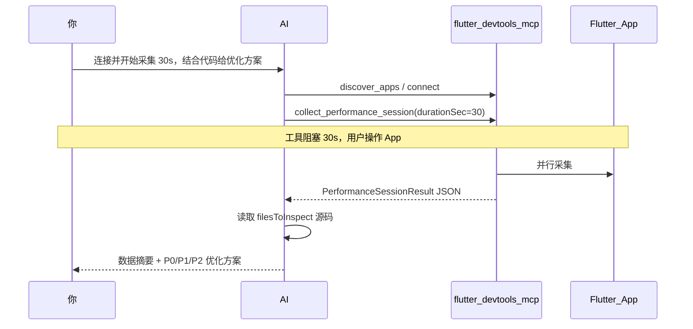

# Flutter 性能采集会话 — 方案设计（两轮对话）

> **产品形态**：用户用两句话完成一次采集；MCP 负责采数据；AI 负责结合代码出优化方案。  
> **优先级**：本方案为 P0；[`performance-audit-requirements.md`](./performance-audit-requirements.md) 中的重型报告降为 P2 可选。  
> **指标怎么读（开发者）**：见 [`performance-metrics-guide.md`](./performance-metrics-guide.md)。

---

## 1. 核心交互（标准话术 — 单轮）

用户对 AI 说（一句话）：

```
连接 Flutter App，开始采集性能数据 30s，结合代码给优化方案
```

可加场景：

```
连接 Flutter App，开始采集性能数据 30s，场景：首页列表滚动，结合代码给优化方案
```

**流程：**

1. AI 调用 `discover_apps` / `connect`
2. AI 调用 `collect_performance_session`（**默认阻塞 30 秒**，期间你在 App 内操作）
3. 工具返回 JSON 后，AI **自动**读取 `filesToInspect` 源码，输出 P0/P1/P2 优化方案

**无需第二句「可以停了」**——30 秒到后工具返回即通知 AI 继续分析。

---

### 可选：分两轮（手动停）

若需自定义时长或提前结束，仍可使用 `durationSec` 参数；提前结束需等当前实现扩展（本期以固定阻塞为主）。

---

## 2. 端到端流程



---

## 3. 角色分工

| 角色 | 职责 | 不做 |
|------|------|------|
| **你** | `flutter run --profile`；两轮对话；App 内操作 30s | 不调 MCP 工具名 |
| **MCP** | 连接 VM；并行采集；`stop` 时输出结构化 JSON | 不调 LLM；不读源码 |
| **AI** | 解析人话 → 调工具；`stop` 后读代码 → 写优化方案 | 不代替你在 App 里操作 |

---

## 4. AI 行为约定

### 收到「连接…开始采集性能数据 30s…结合代码给优化方案」

AI **必须依次**：

1. `discover_apps` / `connect`（若未连接）
2. `collect_performance_session({ scenario, durationSec: 30 })` — **会阻塞约 30s**
3. 在工具返回后，读取 `filesToInspect` 中的 Dart 文件
4. 按 §7 模板输出 P0/P1/P2 优化方案

**不要在工具返回前编造优化建议。**

---

## 5. MCP 工具设计

### 5.1 沿用现有（第一轮会用到）

| 工具 | 用途 |
|------|------|
| `discover_apps` | 自动发现并连接 |
| `connect` | 手动 URI 连接 |

### 5.2 新增（本方案核心）

#### `collect_performance_session`（主工具）

| 参数 | 类型 | 默认 | 说明 |
|------|------|------|------|
| `scenario` | string | `manual-session` | 场景标识 |
| `durationSec` | number | **30** | 阻塞等待秒数，到时自动 stop |
| `enableNetwork` | boolean | true | 是否采网络 |
| `enableCpuProfile` | boolean | true | 是否采 Top 耗时函数 |
| `topN` | number | 15 | Top 列表条数 |
| `saveToFile` | boolean | false | 写入 `{projectRoot}/performance-sessions/*.json` |
| `projectRoot` | string | - | Flutter 工程根目录，用于报告落盘与业务代码过滤 |

**行为：** start 全部采集器 → `sleep(durationSec)` → stop → 返回 JSON + 中文摘要 + `aiNextStep` 提示 AI 读源码。

---

## 6. 数据结构 `PerformanceSessionResult`（当前实现）

```typescript
interface PerformanceSessionResult {
  scenario: string;
  durationSec: number;
  profileModeHint: string; // 若非 profile，提示数据可能失真

  frames: {
    total: number;
    jankCount: number;
    jankPct: number;
    avgMs: number;
    p99Ms: number;
    buildMaxMs: number;
    layoutMaxMs: number;
    paintMaxMs: number;
  };

  topFunctions: Array<{
    name: string;
    file: string;
    selfMs: number;
    pct: number;
    severity: "low" | "medium" | "high" | "critical";
  }>;

  /** 仅业务工程 lib/ 的耗时方法（Top10） */
  projectTopFunctions: Array<{
    name: string;
    file: string;
    selfMs: number;
    pct: number;
    severity: "low" | "medium" | "high" | "critical";
  }>;

  topRebuilds: Array<{
    widget: string;
    file: string;
    line: number;
    count: number;
    severity: "low" | "medium" | "high" | "critical";
  }>;

  memory: {
    heapMb: number;
    utilizationPct: number;
    topClasses: Array<{ name: string; instances: number; bytesMb: number }>;
    suspicious: string[];
  };

  network: {
    total: number;
    errors: number;
    slow: Array<{ method: string; url: string; ms: number; status?: number }>;
  };

  /** GC 停顿（Timeline GC 流） */
  gc?: {
    count: number;
    totalPauseMs: number;
    maxPauseMs: number;
    avgPauseMs: number;
    longPauseCount: number;
  };

  /** 滚动/交互分段 FPS（默认 2s 窗口） */
  scrollFps?: {
    segmentSec: number;
    overallFps: number;
    worstSegments: Array<{
      startSec: number;
      endSec: number;
      frames: number;
      fps: number;
      jankCount: number;
      jankPct: number;
      avgMs: number;
      maxMs: number;
    }>;
  };

  /** 图片解码；slow[] 可含 url/width/height/bytes（需业务 Timeline 埋点） */
  imageDecode?: {
    count: number;
    totalMs: number;
    maxMs: number;
    slow: Array<{
      name: string;
      ms: number;
      url?: string;
      width?: number;
      height?: number;
      bytes?: number;
    }>;
  };

  /** 主/后台 isolate CPU 对比 */
  isolateCpu?: Array<{
    isolateId: string;
    name: string;
    isMain: boolean;
    sampleCount: number;
    topSelfMs: number;
    topName: string;
  }>;

  /** AI 应优先打开的文件路径（去重） */
  filesToInspect: string[];

  /** 预生成线索，AI 结合源码展开 */
  hintsForAnalysis: string[];

  cpuProfileSource?: "vm-samples" | "timeline-dart" | "timeline-hotspot" | "none";
  aiAnalysis?: string;
}
```

**`filesToInspect` 生成规则：**

- `topRebuilds` 的 `file`
- `projectTopFunctions` 的 `file`
- 上限 10 个文件

**`hintsForAnalysis` 生成规则（规则引擎，非 LLM）：**

- 重建 > 50 次 → `过度重建: {widget} @ {file}:{line}`
- jank > 5% → `掉帧率偏高: {jankPct}%`
- GC 长停顿 / 图片慢解码 / 滚动最差段 / 仅主 isolate 等 → 对应中文线索
- 慢请求 > 2s → `慢接口: {method} {url}`
- 堆利用率 > 85% → `内存利用率偏高`
- **不再**把框架 `drawFrame` 链路写入线索（对业务定位无帮助）

**CPU 数据来源字段：**

- `cpuProfileSource = vm-samples | timeline-dart | timeline-hotspot | none`
- 优先 `vm-samples`，为空时回退 Timeline

---

## 6.1 业务耗时方法统计

### 目标

避免报告被 Flutter 框架热点淹没，单独给出业务 `lib/` 方法 Top10。

### 规则

1. 从完整采样表过滤业务方法（`lib/`、`package:<app>/`，排除 SDK / `dart:ui` 误归一）
2. 业务条目即使不在全局 Top 也会合并进结果
3. 若为空，AI 报告显示「未命中业务方法」并给重采建议
4. AI 报告小节：`业务耗时方法 Top10（lib/）`；**开发者结论不展示框架 CPU Top**

### 已知限制

- Android profile 下 Self 时间常落在框架叶子，业务符号命中率依赖采样窗口与路径解析
- 建议 30~60s 采集，并在窗口内持续操作页面

---

## 6.2 扩展指标（GC / 滚动 / 图片 / Isolate）

详见 [`performance-metrics-guide.md`](./performance-metrics-guide.md) §3～§5。

| 字段 | 说明 |
|------|------|
| `gc` | Timeline GC：次数、停顿；用于尖刺与分配偏勤旁证 |
| `scrollFps` | 2s 分段 FPS/jank；帧事件不足时可能回退整体 FPS |
| `imageDecode` | 解码次数/耗时；`slow[].url` 需 `app.imageDecode` 埋点 |
| `isolateCpu` | 主/后台 isolate 采样对比 |

图片带 URL 的业务接入：[`../examples/app_network_image_README.md`](../examples/app_network_image_README.md)。

---

## 7. AI 优化方案输出模板

规则引擎生成的 `.ai.md` **必须**接近以下结构（实现见 `ai-analysis.ts`）：

```markdown
# 性能优化方案（规则引擎 + 源码对照）

**场景**: … | **采集**: …s | **掉帧**: …%

## 运行时摘要
- 帧 [🟢/🟡/🔴/⚪]: … → …
- 重建 […]
- 耗时函数 […]（Self >20ms → 异常）
- 滚动 / GC / 图片解码 / Isolate / 网络 / 内存 …

## 开发者结论（先看这里）
- [P0] … — 改法
- [P1] … — 改法

## P0（必须修复）
### …
- **数据依据**: …
- **原因**: …
- **改法**: …

## P1 / P2 …
## 耗时函数 Top10 / GC / 图片解码 / Isolate …
```

验证：改完后再采一轮，对比 jank、耗时函数、图片解码最长耗时。

---

## 8. 实现清单

| # | 模块 | 说明 |
|---|------|------|
| 1 | `services/rebuild-tracker-service.ts` | Widget 重建（debug） |
| 2 | `services/network-capture-service.ts` | HttpClient 网络 |
| 3 | `services/cpu-profiler-service.ts` | `getCpuSamples` + 业务过滤 |
| 4 | `services/timeline-extras.ts` | GC / 滚动 FPS / 图片解码 |
| 5 | `services/performance-session.ts` | 编排采集，产出 JSON |
| 6 | `services/ai-analysis.ts` | 规则引擎 `.ai.md`（开发者结论） |
| 7 | `tools/performance-session.ts` | MCP `collect_performance_session` |
| 8 | `examples/app_network_image.dart` | 图片 URL 埋点样板 |

**本期不做：** HTML 报告、健康评分、自动化场景、`performance-audit` 全套。

---

## 9. 前置条件

```bash
# 终端 1：启动 App（推荐 profile）
flutter run --profile

# Cursor：配置 MCP 指向 dist/index.js
# 工作区：打开 Flutter 项目根目录（AI 才能读 lib/）
```

---

## 10. 异常处理

| 情况 | AI 回复要点 |
|------|-------------|
| 未发现 App | 提示先 `flutter run`，或粘贴 VM URI |
| 重复 start | 先说「已在采集中」，或先 stop 再 start |
| 未 start 就 stop | 提示先执行第一轮话术 |
| 采集 < 5s | 警告数据可能不足，建议重新采 30s |
| 网络为空 | 说明可能未走 dart:io，其他维度仍给方案 |

---

## 11. 验收标准

1. 第一轮话术后，MCP 返回「已开始采集」
2. 操作 30s 后第二轮话术，`stop` 返回合法 JSON
3. JSON 含 `topRebuilds[].line`、`topFunctions[].file`、`hintsForAnalysis`
4. AI 能根据 `filesToInspect` 打开对应 dart 文件并输出 P0/P1 方案
5. 原有 21 个工具行为不变

---

## 13. 回归命令（当前）

```bash
# Android debug 回归
npm run test:regression:android

# Android profile 回归（默认时长）
npm run test:regression:android:profile

# Android profile 回归（30s）
npm run test:regression:android:profile:30s
```

> 说明：profile 模式不支持 Widget 重建追踪；帧数偶发偏低时，以 `vm-samples` + 网络 + AI 规则分析为准。

---

## 12. 对话速查卡

```
【一句搞定】
连接 Flutter App，开始采集性能数据 30s，场景：<场景名>，结合代码给优化方案

【你要做】
工具运行后立刻在 App 里操作约 30 秒（工具会自动等待并返回）

【AI 自动做】
返回 JSON → 读 filesToInspect → 输出 P0/P1/P2 优化方案
```
